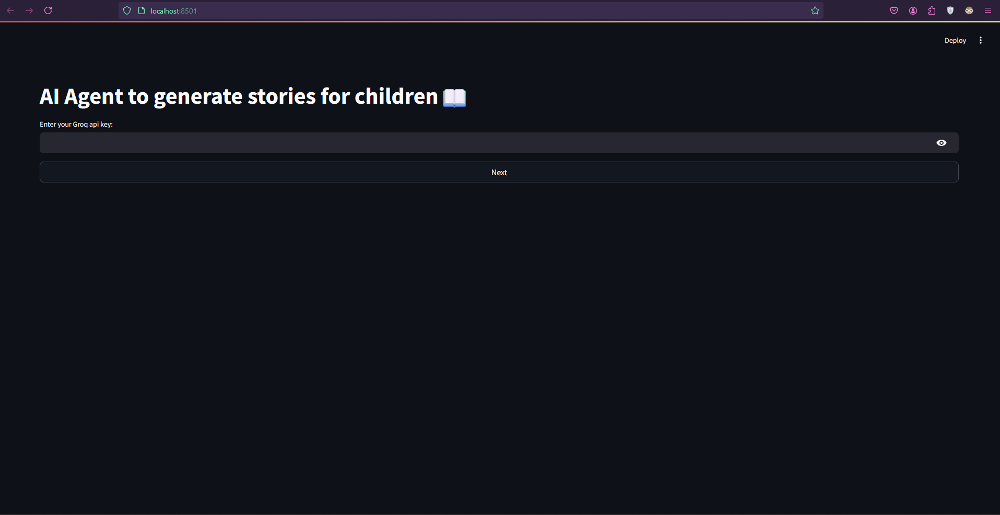
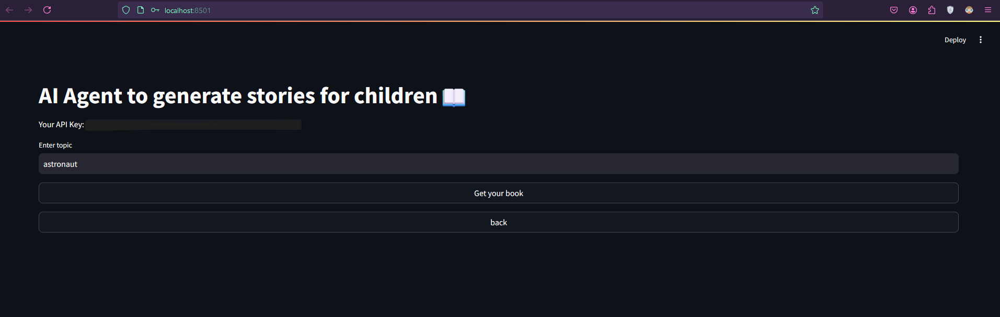
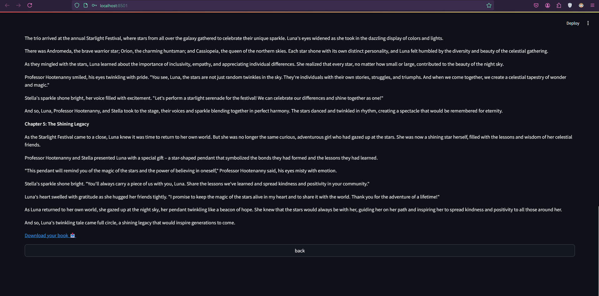
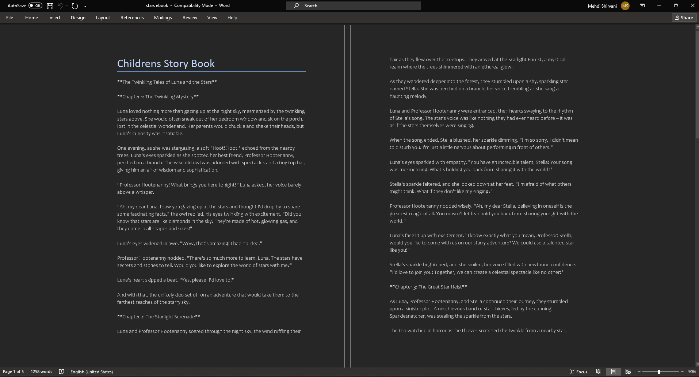

**Ghessebot v1.1.1**

# Ghessebot

Ghessebot is an AI-powered tool that helps users create personalized stories and e-books for children. Leveraging advanced AI models and Streamlit for an intuitive interface, Ghessebot simplifies the storytelling process.
---
## Images
Environment of Ghessebot





## Features

- **AI-Generated Stories**: Generate unique and engaging stories based on your input topics.
- **DOCX Support**: Save your stories as `.docx` files.
- **Streamlit Interface**: User-friendly web interface for seamless interaction.
- **Groq API Integration**: Utilizes the Groq API for robust AI capabilities.

---

## Requirements

- Python 3.8 or higher
- A valid Groq API key
- The following Python packages (listed in `requirements.txt`):
  - `streamlit`
  - `crewai`
  - `langchain_openai`
  - `python-docx`

---

## Installation

1. **Clone the repository**:
   ```bash
   git clone https://github.com/MahdiShirvani01/Ghessebot.git
   cd Ghessebot
2. **Install dependencies**
  ```bash
    pip install -r requirements.txt
3. **Run the app**
  ```bash
    streamlit run story.py